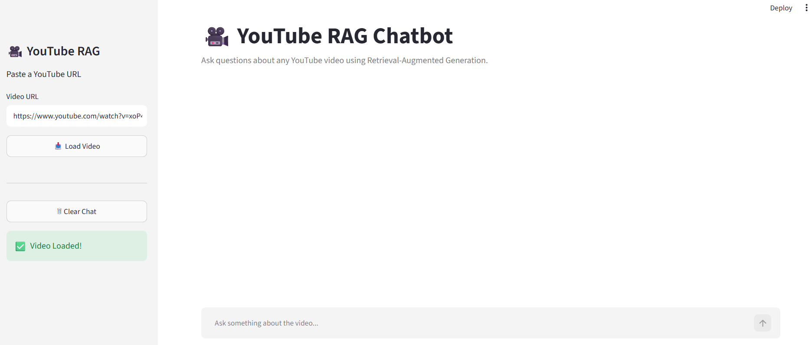
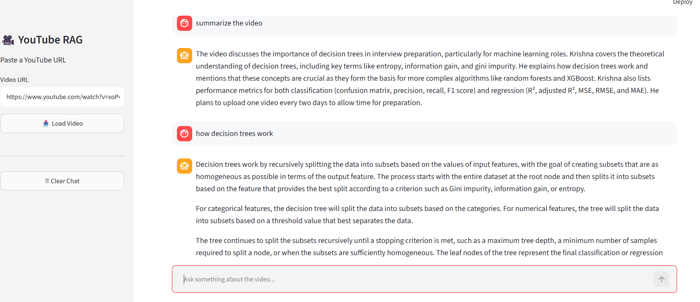

# 🎥 YouTube RAG Chatbot

An AI-powered chatbot that allows users to ask questions about any YouTube video using **Retrieval-Augmented Generation (RAG)**. The application extracts the video's transcript, creates semantic embeddings, retrieves the most relevant context, and generates accurate answers using a Hugging Face Large Language Model.

---

## 🚀 Features

* 🎥 Ask questions about any YouTube video
* 📄 Automatically fetches YouTube transcripts
* 🧠 Retrieval-Augmented Generation (RAG) pipeline
* 🔍 Semantic search using Hugging Face embeddings
* 📚 FAISS vector database for fast retrieval
* 🤖 Hugging Face Inference API for answer generation
* 💬 Modern Streamlit chat interface
* 📜 Conversation history
* 🌗 Dark and Light mode friendly UI
* 🔗 Supports full YouTube URLs
* ⚡ Fast and interactive responses

---

## 🛠️ Tech Stack

### Frontend

* Streamlit

### Backend

* Python

### AI & Machine Learning

* LangChain
* Hugging Face Inference API
* Hugging Face Embeddings (BAAI/bge-small-en-v1.5)

### Vector Database

* FAISS

### Data Source

* YouTube Transcript API

### Other Libraries

* python-dotenv
* sentence-transformers
* langchain-community
* langchain-text-splitters

---

## 🧠 How It Works

```text
User
   │
   ▼
Enter YouTube URL
   │
   ▼
Extract Transcript
   │
   ▼
Split Transcript into Chunks
   │
   ▼
Generate Embeddings
   │
   ▼
Store in FAISS Vector Database
   │
   ▼
Retrieve Relevant Chunks
   │
   ▼
Create Prompt
   │
   ▼
Hugging Face LLM
   │
   ▼
Generate Answer
```

---

## 📂 Project Structure

```text
youtube-chatbot/
│
├── app.py
├── rag.py
├── config.py
├── requirements.txt
├── README.md
├── .gitignore
├── .env.example
│
├── utils/
│   ├── transcript.py
│   ├── embeddings.py
│   ├── vectorstore.py
│   └── prompt.py
│
├── assets/
│
└── .streamlit/
    └── config.toml
```

---

## ⚙️ Installation

### 1. Clone the repository

```bash
git clone https://github.com/<your-username>/youtube-rag-chatbot.git

cd youtube-rag-chatbot
```

---

### 2. Create a virtual environment

**Windows**

```bash
python -m venv venv

venv\Scripts\activate
```

**Linux / macOS**

```bash
python3 -m venv venv

source venv/bin/activate
```

---

### 3. Install dependencies

```bash
pip install -r requirements.txt
```

---

### 4. Create a `.env` file

Create a file named `.env` in the project root.

```text
HF_TOKEN=your_huggingface_api_token
```

---

### 5. Run the application

```bash
streamlit run app.py
```

The application will open automatically in your browser.

---

## 📸 Screenshots

Add screenshots after building your application.

```
screenshots/
│
├── home.png
├── chat.png
```

Example:

```markdown
## Home



## Chat


```

---

## 📦 Requirements

* Python 3.10+
* Hugging Face API Token
* Internet connection

---

## 📖 Example Workflow

1. Launch the application.
2. Paste a YouTube video URL.
3. Click **Load Video**.
4. Wait for the transcript to be processed.
5. Ask questions related to the video.
6. Receive context-aware answers generated using RAG.

---

## 🔍 RAG Pipeline

This project follows a Retrieval-Augmented Generation workflow:

* Retrieve the YouTube transcript
* Split transcript into semantic chunks
* Generate embeddings using Hugging Face
* Store embeddings in FAISS
* Retrieve the most relevant chunks
* Send retrieved context to the LLM
* Generate an answer grounded in the transcript

---

## 🌟 Future Improvements

* Video thumbnail preview
* Multi-video chat support
* Source citations for retrieved chunks
* Persistent vector database
* PDF export of conversations
* Voice input and speech output
* Authentication and user profiles
* Streaming responses
* Deployment using FastAPI + Next.js

---

## 🤝 Contributing

Contributions are welcome.

1. Fork the repository.
2. Create a new branch.
3. Commit your changes.
4. Push to your branch.
5. Open a Pull Request.

---

## 📄 License

This project is licensed under the MIT License.

---

## 👩‍💻 Author

**Shreya Reja**

If you found this project useful, consider giving it a ⭐ on GitHub.
